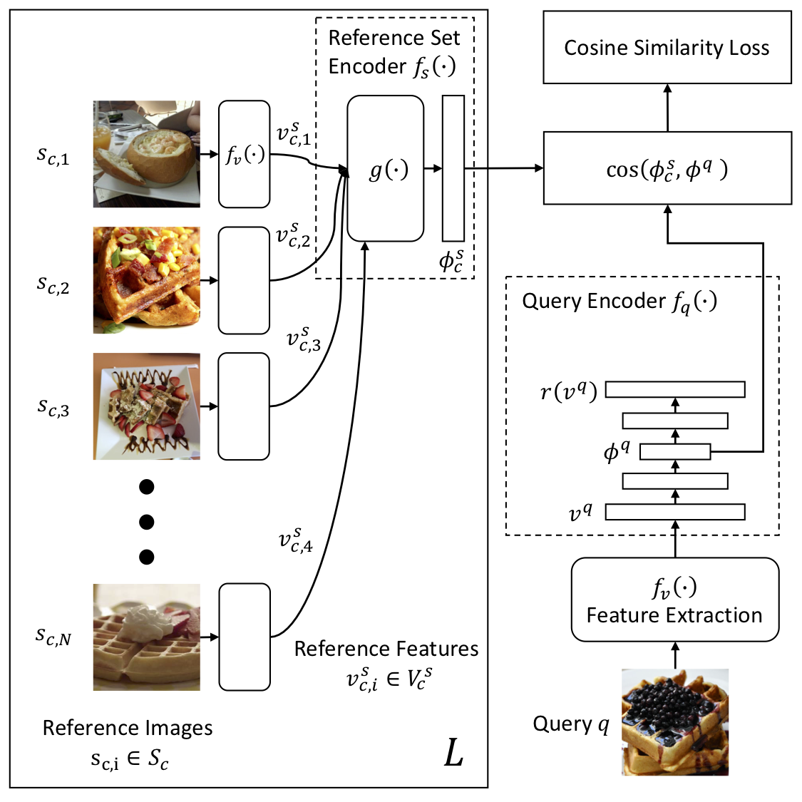
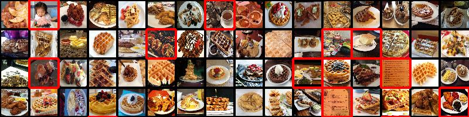

[Kuang-Huei Lee](https://scholar.google.com/citations?user=rE7-N30AAAAJ&hl)<sup>1</sup>, [Xiaodong He](https://scholar.google.com/citations?user=W5WbqgoAAAAJ)\*<sup>2</sup>, [Lei Zhang](https://www.microsoft.com/en-us/research/people/leizhang/)<sup>1</sup>, [Linjun Yang](https://scholar.google.com/citations?user=cvgKxDQAAAAJ)\*<sup>3</sup><br>
<sup>1</sup> Microsoft AI and Research, <sup>2</sup> JD AI Research, <sup>3</sup> Facebook<br>
(* Work performed while working at Microsoft)

### [[ Paper ]](https://arxiv.org/abs/1711.07131) [ Dataset ] [ Code ]

This is the CleanNet project page. CleanNet is a neural network achitecture for learning image classification in presence of label noise and label noise detection using minimum human supervision from Microsoft AI and Research. The CleanNet paper will appear in CVPR 2018.

### Abstract

In this paper, we study the problem of learning image classification models with label noise. Existing approaches depending on human supervision are generally not scalable as manually identifying correct or incorrect labels is time-consuming, whereas approaches not relying on human supervision are scalable but less effective. To reduce the amount of human supervision for label noise cleaning, we introduce CleanNet, a joint neural embedding network, which only requires a fraction of the classes being manually verified to provide the knowledge of label noise that can be transferred to other classes. We further integrate CleanNet and conventional convolutional neural network classifier into one framework for image classification learning. We demonstrate the effectiveness of the proposed algorithm on both of the label noise detection task and the image classification on noisy data task on several large-scale datasets. Experimental results show that CleanNet can reduce label noise detection error rate on held-out classes where no human supervision available by 41.5% compared to current weakly supervised methods. It also achieves 47% of the performance gain of verifying all images with only 3.2% images verified on an image classification task.




### Food-101N Dataset
<br>

The Food-101N dataset will be made available soon.

### Code
The code will be made available soon.

# Citation

```
@article{lee2017cleannet,
  title={CleanNet: Transfer Learning for Scalable Image Classifier Training with Label Noise},
  author={Lee, Kuang-Huei and He, Xiaodong and Zhang, Lei and Yang, Linjun},
  journal={arXiv preprint arXiv:1711.07131},
  year={2017}
}
```

# Acknowledgments

We would like to thank [Xi Chen](https://sites.google.com/site/xichenstephen/), Bosco Chiu, [Yandong Guo](https://www.microsoft.com/en-us/research/people/yag/) and [Po-Sen Huang](https://posenhuang.github.io/) for their thoughtful feedback and discussions. Thanks also to Kelly Huang and [Arun Sacheti](https://www.linkedin.com/in/asacheti/) for helping development of the Food-101N dataset.
